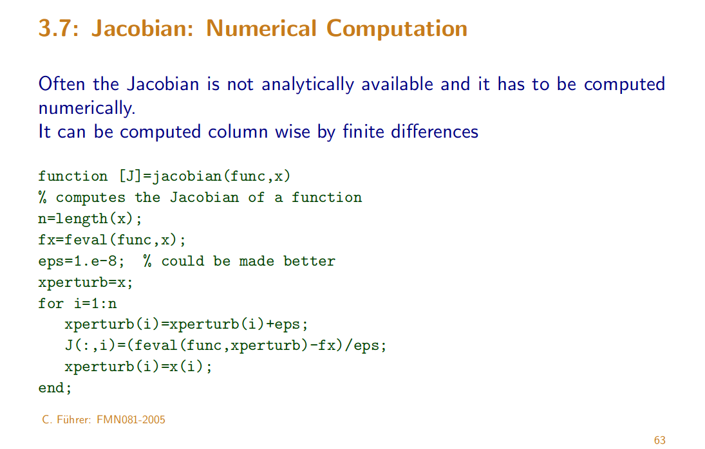

# Notes

[toc]

We can use any standard finite difference approximation to get a Jacobian: 

`H(i,j) = diff(output(i)) / diff(input(j))`

works but computationally it can be expensive. If output returns as a vector, get the columns of `H` as vectors:

`H(:,j) = diff(output)/diff(input(j))`

## Jacobian, numerical computation

Slides: http://www.maths.lth.se/na/courses/FMN081/FMN081-06/lecture7.pdf

