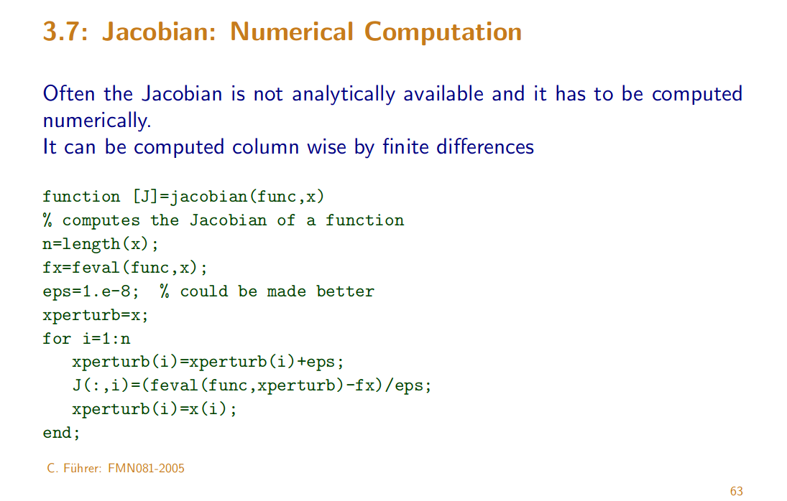
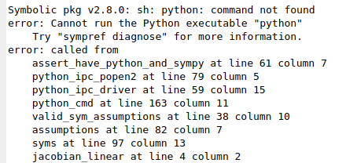
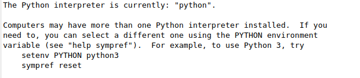

# Notes on Jacobians in Octave

[toc]

## Status

These Jacobian functions run fine in `Octave`. I am trying to stay away from Matlab.

Simple Jacobians at the moment; testing functionality.

In Octave, the package `symbolic` needs to be loaded before running some of the Jacobian functions.

```
pkg load symbolic
```


## Finite difference

We can use any standard finite difference approximation to get a Jacobian: 

`H(i,j) = diff(output(i)) / diff(input(j))`

works but computationally it can be expensive. If output returns as a vector, get the columns of `H` as vectors:

`H(:,j) = diff(output)/diff(input(j))`


## Jacobian, numerical computation

Slides: http://www.maths.lth.se/na/courses/FMN081/FMN081-06/lecture7.pdf




### Fix `symbolic` library for Octave

When running in Octave:

```
pkg load symbolic
```


We get this error: 



Fix by running this first:

```
sympref diagnose
```



```matlab
# run these in Octave console
setenv PYTHON python3         # indicate correct default Python
sympref reset
sympref diagnose
```


Now we can successfully run:

```
pkg load symbolic
```

